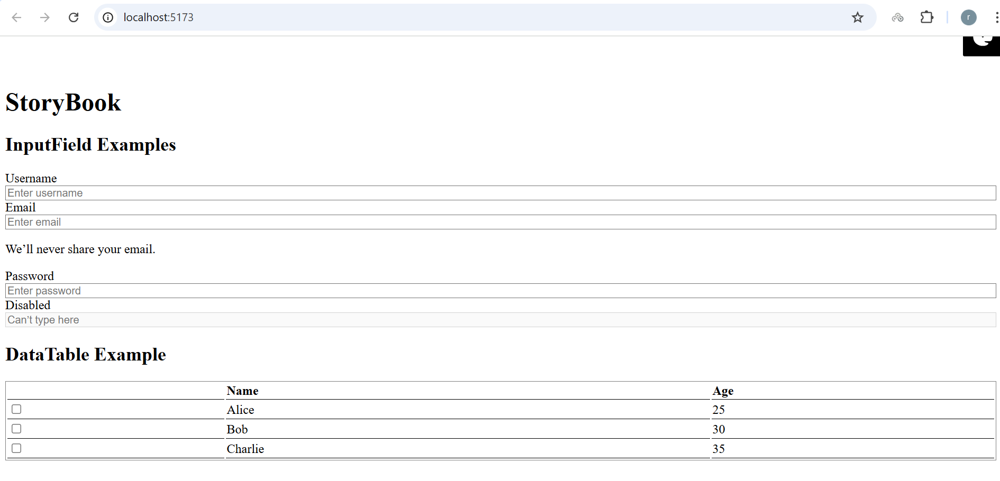
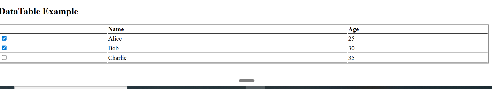

# 🎨 React Component Development Assignment

This project contains two reusable React components — **InputField** and **DataTable** — built with **React, TypeScript, TailwindCSS, Vite, and Storybook**.  
It demonstrates modern React component design with accessibility, responsive styling, tests, and Storybook documentation.

---

## 🚀 Components

### 1. InputField
A flexible input component with multiple states, variants, and accessibility support.

**Features:**
- Text input with label, placeholder, helper text, error message  
- States: `disabled`, `invalid`, `loading`  
- Variants: `filled`, `outlined`, `ghost`  
- Sizes: `sm`, `md`, `lg`  
- Optional: clear button, password toggle  
- Light/Dark theme support  

📸 Demo:  


---

### 2. DataTable
A customizable data table with sorting, selection, and state handling.

**Features:**
- Display tabular data  
- Column sorting  
- Row selection (single/multiple)  
- Loading and empty states  
- Customizable columns  

📸 Demo:  


---

## ✅ Tech Stack
- [React](https://react.dev/) + [TypeScript](https://www.typescriptlang.org/)  
- [Vite](https://vitejs.dev/) for fast builds  
- [TailwindCSS](https://tailwindcss.com/) for styling  
- [Storybook](https://storybook.js.org/) for documentation  
- [Vitest](https://vitest.dev/) for testing  

---

## 📦 Installation & Setup

Clone the repository:

```bash
git clone https://github.com/your-username/react-components-assignment.git
cd react-components-assignment
Install dependencies:

bash
Copy
Edit
npm install
Run the development server:

bash
Copy
Edit
npm run dev
Run Storybook:

bash
Copy
Edit
npm run storybook
Run tests:

bash
Copy
Edit
npm run test
📘 Demo Usage
tsx
Copy
Edit
import InputField from "./components/InputField";
import DataTable, { type Column } from "./components/DataTable";

// Row type for table
type Person = { id: number; name: string; age: number };

const sampleData: Person[] = [
  { id: 1, name: "Alice", age: 25 },
  { id: 2, name: "Bob", age: 30 },
  { id: 3, name: "Charlie", age: 35 },
];

const columns: Column<Person>[] = [
  { key: "name", title: "Name", dataIndex: "name", sortable: true },
  { key: "age", title: "Age", dataIndex: "age", sortable: true },
];

export default function App() {
  return (
    <div className="min-h-screen bg-gray-100 flex items-center justify-center p-10">
      <div className="space-y-10 w-full max-w-3xl bg-white p-8 rounded-2xl shadow-lg">
        <h1 className="text-2xl font-bold text-blue-600">StoryBook Demo</h1>

        {/* InputField Examples */}
        <section className="space-y-4">
          <InputField label="Username" placeholder="Enter username" />
          <InputField
            label="Email"
            placeholder="Enter email"
            helperText="We’ll never share your email."
          />
          <InputField
            label="Password"
            placeholder="Enter password"
            type="password"
            invalid
            errorMessage="Password is too short"
          />
          <InputField label="Disabled" placeholder="Can’t type here" disabled />
        </section>

        {/* DataTable Example */}
        <section className="space-y-4">
          <DataTable<Person>
            data={sampleData}
            columns={columns}
            selectable
            onRowSelect={(rows) => console.log("Selected rows:", rows)}
          />
        </section>
      </div>
    </div>
  );
}
📂 Folder Structure

Copy
Edit
.
├── .storybook/           # Storybook configuration
├── public/               # Public assets
├── src/
│   ├── assets/           # Screenshots & static assets
│   │   ├── react.svg
│   │   ├── inputfield-demo.png
│   │   ├── datatable-demo.png
│   ├── components/       # Core reusable components
│   │   ├── __tests__/    # Component tests
│   │   ├── DataTable.tsx
│   │   ├── InputField.tsx
│   ├── stories/          # Storybook stories (demo usage)
│   │   ├── InputField.stories.tsx
│   │   ├── DataTable.stories.tsx
│   │   ├── Button.stories.ts
│   │   ├── Header.stories.ts
│   │   ├── Page.stories.ts
│   │   ├── Configure.mdx
│   │   ├── *.tsx + *.css
│   ├── App.tsx           # Root application file
│   ├── main.tsx
│   ├── index.css
│   ├── App.css
│   ├── setupTests.ts
│   └── vite-env.d.ts
├── package.json
├── vite.config.ts
└── README.md
📤 Deployment
Storybook can be deployed via Chromatic or Vercel.

🔗 Live Storybook Preview: Add your link here

# 🚀 Components

### 1. InputField
📸 Demo:  


---

### 2. DataTable
📸 Demo:  


📝 Approach
Built InputField with multiple states, variants, and accessibility (aria-* attributes).

Designed DataTable with TypeScript generics for reusability across data types.

Used TailwindCSS for clean, responsive styling with dark mode support.

Added tests using Vitest to validate rendering & props.

Documented all component states with Storybook stories.

👨‍💻 Author
Built with ❤️ for the Front-End Assignment.

markdown
Copy
Edit

---


